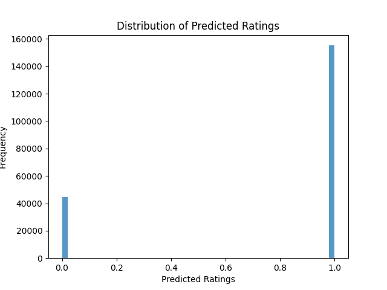

# Graph Neural Network Recommendation System

This project investigates the behavior and stability of Graph Neural Networks (GNNs) for large-scale recommendation systems, with a focus on attention-based architectures.

## Overview
- Benchmarked **GAT, LightGCN, GraphSAGE, and GCN** on the MovieLens 1M dataset
- Implemented models using **PyTorch Geometric**
- Focused on numerical stability, evaluation rigor, and reproducibility

## Key Insight
While experimenting with **Graph Attention Networks (GAT)**, I observed severe numerical instability in regression outputs, with predictions drifting far beyond the expected rating range.

By diagnosing this issue as a gradient flow problem and introducing a **sigmoid-constrained output layer**, training was stabilized and performance improved significantly.

- **Recall@k: 0.968**

## Results

## Project Structure
# Movie Recommendation Engine with Graph Neural Networks (GNN)

This project explores the application of **Graph Neural Networks (GNNs)** to large-scale recommendation systems, with a focus on **representation learning, numerical stability, and empirical evaluation**.  
The work was developed as part of **CS7643: Deep Learning (Georgia Tech OMSCS)**.

---

## 1. Project Motivation

Traditional recommendation systems often rely on matrix factorization or shallow collaborative filtering methods, which struggle to capture complex relational structures between users and items.

In this project, we model the recommendation problem as a **user–item interaction graph** and investigate how different GNN architectures learn expressive embeddings under real-world constraints such as:

- Sparse interactions  
- Heterogeneous neighborhoods  
- Training instability in attention-based models  

---

## 2. Methods & Models

We implemented and benchmarked the following models using **PyTorch Geometric**:

- **GCN (Graph Convolutional Network)**
- **GraphSAGE**
- **LightGCN**
- **Graph Attention Network (GAT)**

### Key architectural focus
- Multi-head attention for heterogeneous neighborhood aggregation
- Embedding dimensionality analysis (64 → 512)
- Over-smoothing diagnostics

---

## 3. Numerical Stability in GATs

During experimentation, we observed **severe regression instability** in Graph Attention Networks, where raw outputs drifted far beyond the valid rating range.

### Diagnosis
- Unconstrained attention-weighted aggregation
- Gradient amplification during message passing

### Solution
We introduced a **sigmoid-based output constraint** to naturally bound predictions to the valid rating range during training, which:

- Stabilized gradient flow
- Improved convergence
- Significantly increased downstream metrics

---

## 4. Results

- **Peak Recall@k:** 0.968 (GAT)
- Consistent improvements across F1-score and ranking metrics after stabilization
- Improved generalization across train/validation graph splits

### Visualizations
Results and diagnostics are available under:
results/figures/
├── Confusion_Matrix.png
└── Distribution_of_Predicted_Ratings.png

## 5. Repository Structure
CS7643_Project/
├── src/
│ ├── GATs_best_model.py # Final stabilized GAT implementation
│ ├── GNN_test.py # Evaluation and testing scripts
│ └── utils/ # Helper functions
├── results/
│ └── figures/
│ ├── Confusion_Matrix.png
│ └── Distribution_of_Predicted_Ratings.png
├── README.md
├── LICENSE
└── .gitignore

---

## 6. Tech Stack

- Python
- PyTorch
- PyTorch Geometric
- NumPy / SciPy
- Matplotlib

---

## 7. Key Takeaways

This project emphasizes that effective deep learning systems require more than architectural novelty.  
**Debugging failure modes, enforcing numerical stability, and designing reliable evaluation pipelines are equally critical**, especially in real-world and large-scale settings.

---

## Author

**Yangming (Katherine) Ye**  
M.S. Computer Science (Machine Learning), Georgia Tech  
Applied Machine Learning / Representation Learning  

